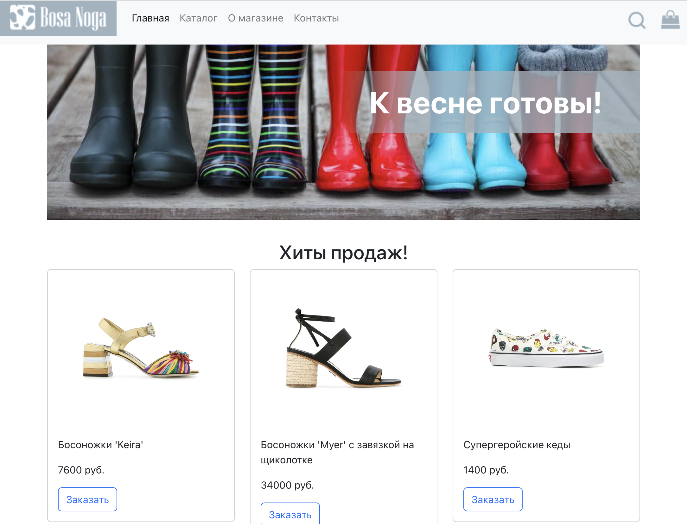
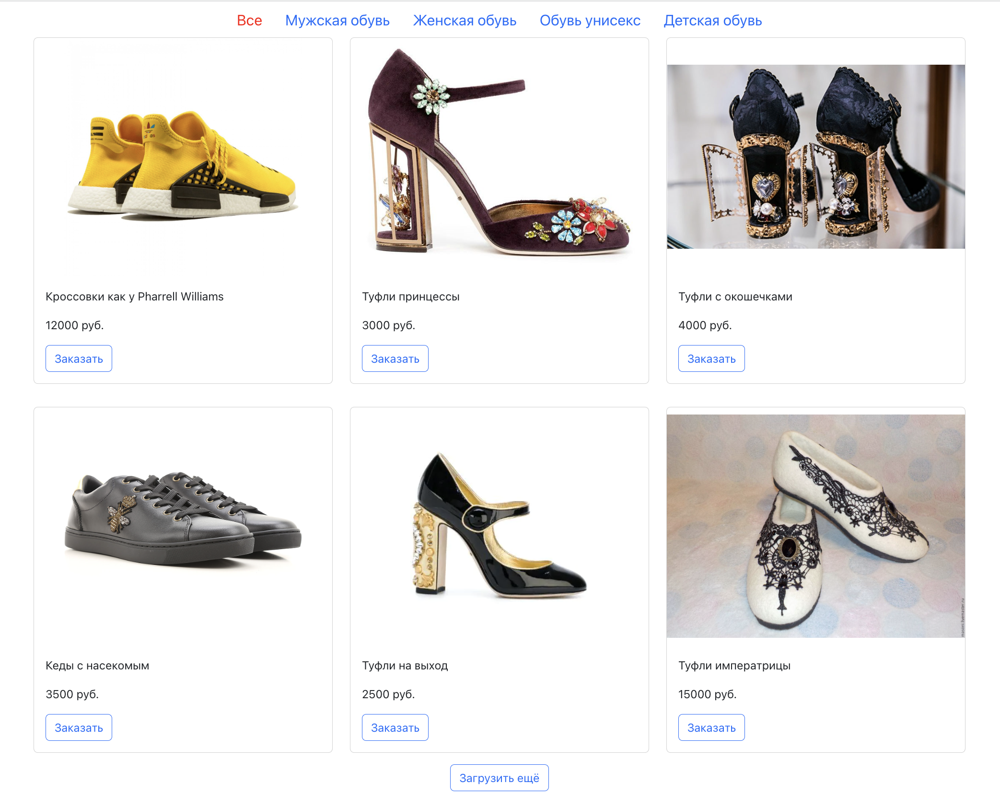
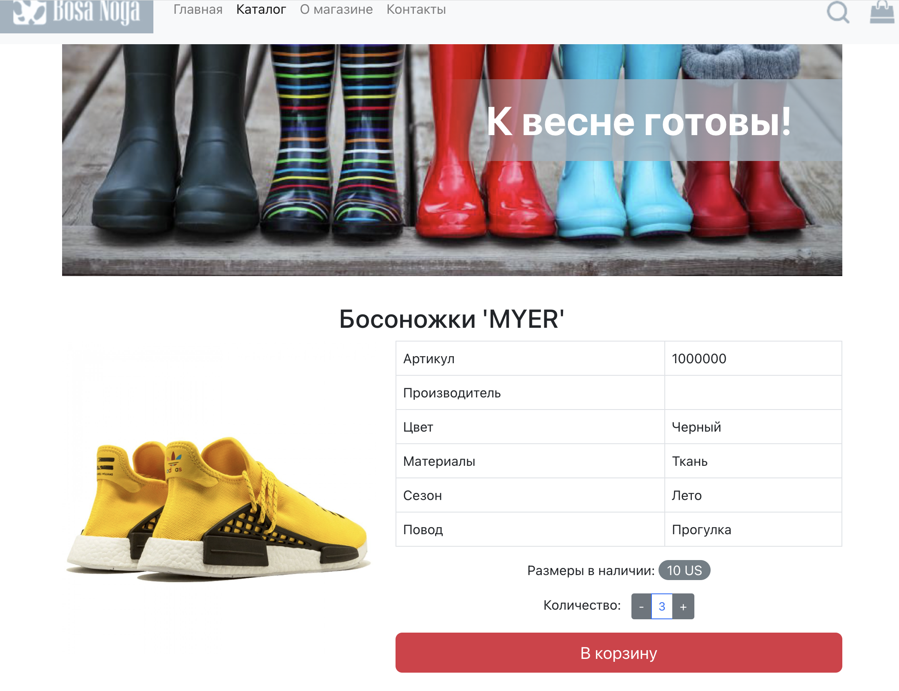
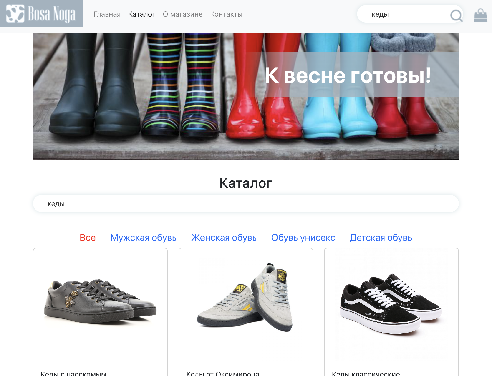
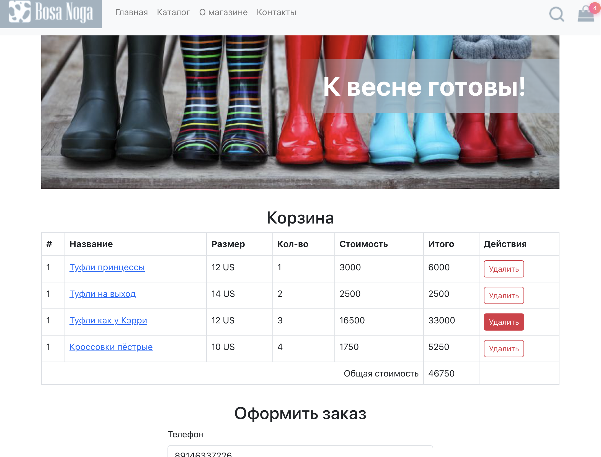

## Интернет-магазин обуви "Bosa Noga"

https://github.com/bazarovarsalan/BosaNoga.git

## Используемые технологии

- React
- Typescript
- Redux Toolkit
- Redux Thunk
- Redux Persist (для реализации и хранения данных в local storage)
- React Router
- Node.js

## Описание

Проект представляет собой frontend-реализацию интернет-магазина обуви с динамической подгрузкой каталога продукции с сервера, фильтрацией, поиском и возможностью оформления заказа.

## Содержание

Приложение содержит следующие самостоятельные экраны (страницы):

1. Главная страница.
1. Каталог товаров.
1. Информационная страница.
1. Страница товара.
1. Корзина.
1. 404

## Переходы между экранами

Навигационным центром приложения являются шапка и футер каждого экрана (страницы):

Из шапки можно попасть на следующие экраны:

- логотип и ссылка «Главная» — ведут на главную страницу, URL — "/";
- каталог — ведёт на страницу каталога, URL — "/catalog";
- о магазине — ведёт на страницу «О магазине», URL — "/about";
- контакты — ведёт на страницу «Контакты», URL — "/contacts".

Из футера можно попасть на следующие экраны:

- о магазине — ведёт на страницу «О магазине», URL — "/about";
- каталог — ведёт на страницу каталога, URL — "/catalog";
- контакты — ведёт на страницу «Контакты», URL — "/contacts".

## REDUX

В проекте реализованые следующие редюсеры:

- topSales (получение товаров - "Хиты продаж"),
- catalogCategories (получение категорий товаров),
- catalogItems (получение товаров соответсвующей категории),
- inputSearch (значение для поиска)
- itemDetails (загрузка данных о выбранном товаре)
- cartAddedItems (товары добавленные в корзину)
- placeTheOrder (запрос на покупку товаров из корзины)

Profi Level

В представленном проекте нашли свое отражение поставленные проблемы:

- Как обрабатывать ситуацию, при которой пользователь покупал товар по одной цене, а когда решил купить, выяснилось, что цена поменялась?

- Ответ: на странице Cart используется функция checkoutPriceFoo направляющая запрос на сервер с целью сравнения каждого товара на предмет соответствия цены, в случае изменения цены функция возвращает булевое значение - true.
  Вызов функции осуществляется при попытке пользователя оплатить товар. При изменении цены, последнему сообщается об этом с рекомендацией ознакомиться с указанными изменениями в карточке товара пользователь.

Как бороться с тем, что приходящие картинки не одинаковые по размеру?

Ответ: У элемента  с className: "card-img-top" применено свойство object-fit со значение contain.

Что показывать пользователю, если поиск не дал результатов?
В случае если поиск не дал результатов на странице Каталога отображается информация о том, что "В данной категории нет товаров"

Каким образом отображать сообщения об ошибке, чтобы либо автоматически, либо с помощью пользователя чуть позже повторно выполнить запрос (без полной перезагрузки страницы)?

Ответ: При ошибке пользователю с помощью компонента ErrorComponent отображается информация об ошибке с кнопкой "Повторить запрос"
